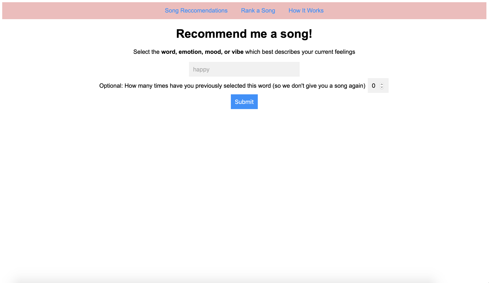

# Mood-based Music Recommendations using crowdsourcing and ranking
## REMARKS and TODOS (read this first!)

I have noticed that the algorithm is ineffective for a few apparent but hard to solve reasons. First, let me express
what I think is effective. I think how I query Spotify to generate song lists and the stochastic nature of how I
implement crowdsourcing allows for a baseline for a list of "good" songs for each specific query. However, what I do
afterwords (i.e. ranking) I feel is ineffective. I utilize Spotify's given metrics to determine the rankings of each
song, which is more ineffective than it is effective as it is the problem I am trying to solve.
When I think of viable solutions, they seem to oppose the Problem Statement below - in other words, I think that the
best solution needs some sort of personalization but not to the extent of removing the algorithm's ability to recommend
a wider breadth of music. I am curious to see that applying  traditional personalized content methods to crowdsourced
song lists could be effective.
**TODOS (maybe)**
* Create a way for users to like/dislike tracks
* Use these insights to train custom  model (SVM, ensemble trees, neural nets? - talking to feed ranking employees, most companies are moving toward deep learning methods) - based on user preferences
* Rank songs based off each user's personal model 

Final remarks: I've noticed that song data is highly unavailable and pricey, so it would be hard to train models on
songs data; however, I think this method may work very well for more accessible entertainment media like memes or poems. 

## Back to the regularly scheduled app

**Table of Contents**
1. App
2. Usage

**App**

Problem statement: it is very difficult to get music recommendations as classic algorithms (i.e. YouTube recs/Spotify 'for you') are biased toward your previous listening history and don't provide a way to appreciate a wider breadth of music.

Home Page

Results for 'agitated'

Example of scoring the song 'Electricity'

Page showing a basic overview of how recommendations work


**Usage**

Clone the repository
```
$git clone https://github.com/neel-one/MusicMood.git
```
Install the necessary packages
```
$pip install spotipy
$pip install flask
```
Create three subdirectories:

artists/

moods/

songs/

(JSON files will be stored there)

(Alternatively, using a JSON object based database such as MongoDB or Firebase would be better)

Register an API key for Spotify and create 'auth.json'
```
{
  'username' :   placeholder,
  'id' :  placeholder,
  'secret' :   placeholder,
  'redirect' :   placeholder,
}
```

Optional:
Pre-compute song lists for common moods
```
$python driver.py
$word_list.txt
```

Set up flask
```
$export FLASK_ENV=app.py
```

Run the program!
```
$flask run
```

Go to your favorite port to see the app (don't use this for production!)
